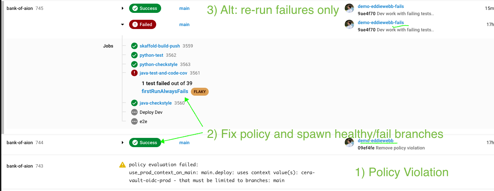

# CERA Demo Assets

Just run `./demo-assets/runDemo.py` and follow the prompts!

### Python/Pip issues.

I moved project to `uv` install `uv` and run:
```
uv venv
uv sync
```


## What Happens

The script above will manage the creation and rebasing of your demo branch to ABC - Always Be Current.

- `stash` any changes in current branch
- delete existing SE Specific demo branches if existing
- Pull latest `main`
- Create SE SPecific branch using GH Handle naming
  

Additionally it will walk through a series of "experiences"

- Starts with a clean, main rebased branch, but not pushed to origin (no build)
  You may opt to go ad-hoc here with changes, or continue on..
  - HIT ENTER
- policy violation - production context on dev branchs, pushed to main and warning in UI
  - HIT ENTER
- Fix policy issue, push to origin, healthy pipeline spawned in UI
- Create alternate [name]-fail branch witha flaky-test failure pushed, failing pipeline spawned in UI.
  - Flaky Test `alwaysFailsFirstRun` will pass locally, fail first CI, pass CI re-runs (SSH or failed retry)  
  **WARNING** If re-run it will Suceed, meaning deploy will run, possibly colliding with the healthy branch.  
  (choose one tail to tell, cancel healthy branch if telling this one)
  


## More Info

### Demo Resources

Start with the 'golden demo' deck in our shared drive, link on [wiki](https://circleci.atlassian.net/wiki/spaces/REV/pages/6836781833/Demoing+for+Discovery)

### Dev Resources

Please see [internal wiki](https://circleci.atlassian.net/wiki/spaces/CE/pages/6826524690/CERA+Demo+App+-+git+Branching+and+Naming+Conventions) for branch naming conventions process.