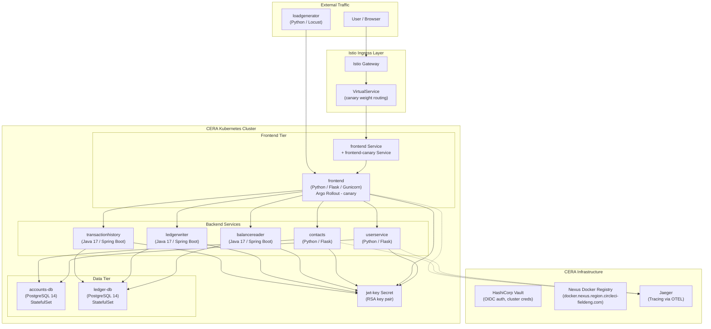
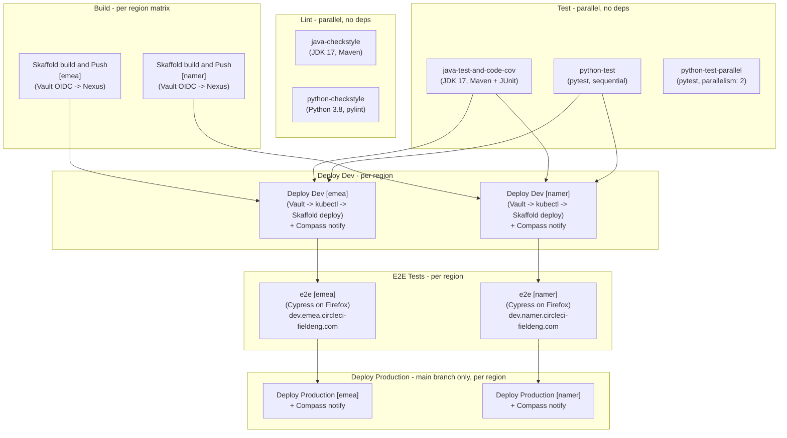

# CCI Bank Corp -- Architecture & CI/CD Pipeline

## Application Architecture & Tech Stack

Shows every service, how they communicate, the databases, and the infrastructure components currently in use.

### Build Methods

| Service | Language | Build Method | Base Image |
|---------|----------|-------------|------------|
| `balancereader` | Java 17 / Spring Boot | Jib (no Dockerfile) | -- |
| `ledgerwriter` | Java 17 / Spring Boot | Jib (no Dockerfile) | -- |
| `transactionhistory` | Java 17 / Spring Boot | Jib (no Dockerfile) | -- |
| `frontend` | Python 3.10 / Flask | Dockerfile | `python:3.10-slim` |
| `userservice` | Python 3.10 / Flask | Dockerfile | `python:3.10-slim` |
| `contacts` | Python 3.10 / Flask | Dockerfile | `python:3.10-slim` |
| `loadgenerator` | Python 3.10 / Locust | Dockerfile | `python:3.10-slim` |
| `accounts-db` | PostgreSQL 14 | Dockerfile | `postgres:14-alpine` |
| `ledger-db` | PostgreSQL 14 | Dockerfile | `postgres:14-alpine` |

All 9 images are pushed to Nexus via Skaffold with git SHA tags.

---

## CI/CD Pipeline (CircleCI Workflow)

Shows every job, its dependencies, and the per-region matrix strategy defined in `.circleci/config.yml`.

### Infrastructure Dependencies Per Stage

- **Build** -- Vault OIDC (`cera-vault-oidc` context) fetches Nexus Docker credentials, then Skaffold builds all 9 images and pushes to `docker.nexus.<region>.circleci-fieldeng.com`
- **Deploy Dev** -- Vault OIDC fetches k8s cluster credentials (`K8S_TOKEN`, `K8S_CERT`, `K8S_URL`, `K8S_NAMESPACE`), configures kubectl manually, runs Skaffold deploy, waits for Argo Rollout, notifies Compass
- **E2E** -- Cypress runs against `https://dev.<region>.circleci-fieldeng.com` (Istio-routed)
- **Deploy Prod** -- Same as Dev but uses `cera-vault-oidc-prod` context and only runs on `main` branch
