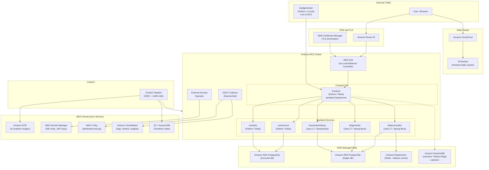
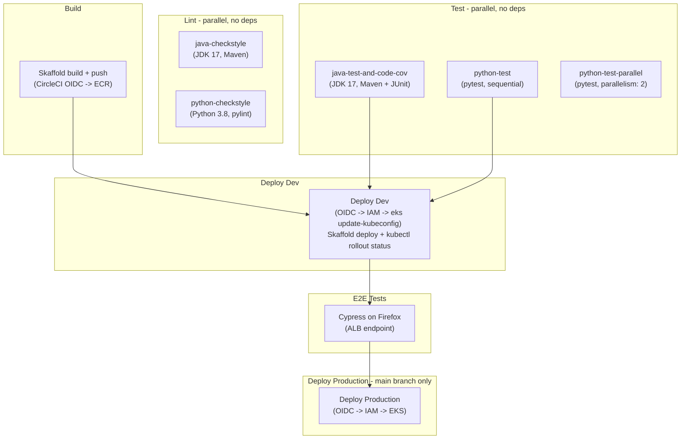

# CCI Bank Corp -- Proposed AWS-Native Architecture

## Architecture Overview

## Proposed Architecture Diagram (Mermaid)

---

## Proposed CI/CD Pipeline

### Infrastructure Dependencies Per Stage

- **Build** -- CircleCI OIDC assumes an IAM role with ECR push permissions; Skaffold builds all 9 images and pushes to ECR with git SHA tags
- **Deploy Dev** -- CircleCI OIDC assumes an IAM role with EKS access; `aws eks update-kubeconfig` configures kubectl; Skaffold deploy applies manifests; `kubectl rollout status` confirms health
- **E2E** -- Cypress runs against the ALB endpoint (Route 53 DNS name)
- **Deploy Prod** -- Same as Dev but uses a separate IAM role / context and only runs on `main` branch

---

## Current vs. Proposed Comparison

| Concern | Current (CERA) | Proposed (AWS) |
|---------|---------------|----------------|
| **Container registry** | Nexus on CERA | Amazon ECR |
| **Cluster** | CERA k8s | Amazon EKS |
| **Ingress** | Istio Gateway + VirtualService | AWS ALB (Load Balancer Controller) |
| **TLS** | Manual / Istio | AWS Certificate Manager (free, auto-renewing) |
| **DNS** | `*.circleci-fieldeng.com` | Amazon Route 53 |
| **Frontend deploy strategy** | Argo Rollout (canary) | Standard Deployment (rolling update) |
| **accounts-db** | PostgreSQL StatefulSet (emptyDir -- ephemeral!) | Amazon RDS PostgreSQL (persistent, managed) |
| **ledger-db** | PostgreSQL StatefulSet (emptyDir -- ephemeral!) | Amazon RDS PostgreSQL (persistent, managed) |
| **Balance cache** | In-memory (lost on restart) | Amazon ElastiCache Redis (shared, persistent) |
| **Sessions / config** | None | Amazon DynamoDB (optional) |
| **Static assets** | Served by frontend pod | S3 + CloudFront |
| **Secrets** | Vault on CERA + plaintext ConfigMaps | AWS Secrets Manager + External Secrets Operator |
| **Tracing** | Jaeger on CERA | AWS X-Ray via ADOT Collector |
| **Monitoring** | None explicit | CloudWatch Container Insights |
| **CI/CD auth** | Vault OIDC | CircleCI OIDC -> AWS IAM |
| **IaC state** | None | S3 + DynamoDB (Terraform) |
| **Multi-region strategy** | Matrix per CERA region (emea, namer) | Single cluster (configurable via pipeline params) |

---

## Effort Tiers

### Infra-only (no app code changes)

- **EKS, ECR, ALB, ACM, Route 53** -- core platform, already planned
- **Amazon RDS PostgreSQL** -- replace in-cluster StatefulSets; only connection string env vars change
- **AWS Secrets Manager + External Secrets Operator** -- inject secrets into k8s, remove plaintext ConfigMaps
- **CloudWatch Container Insights** -- install EKS addon
- **S3 + DynamoDB for Terraform state** -- backend configuration

### Minor app code changes

- **Amazon ElastiCache Redis** -- update `balancereader` cache config to use Redis instead of in-memory (`CACHE_SIZE` env var)
- **AWS X-Ray via ADOT Collector** -- swap OTEL exporter endpoint from Jaeger to ADOT DaemonSet; add X-Ray propagator
- **CloudFront + S3 for static assets** -- extract CSS/JS/images from frontend container, serve from S3

### Optional / future (larger scope)

- **Amazon DynamoDB for sessions / feature flags** -- requires adding session middleware to the frontend Flask app
- **CloudFront + S3** -- can be deferred if frontend pod performance is acceptable

---

## AWS Services Summary

| AWS Service | Purpose | Required? |
|-------------|---------|-----------|
| Amazon EKS | Run microservices | Yes |
| Amazon ECR | Container image registry | Yes |
| AWS ALB + LB Controller | Ingress and traffic routing | Yes |
| Amazon RDS PostgreSQL | Managed databases (accounts-db, ledger-db) | Yes |
| AWS Secrets Manager | Store DB creds, JWT keys, API keys | Yes |
| External Secrets Operator | Sync Secrets Manager into k8s Secrets | Yes |
| AWS Certificate Manager | TLS certificates for ALB | Yes |
| Amazon Route 53 | DNS management | Yes |
| CircleCI OIDC + AWS IAM | CI/CD authentication | Yes |
| Amazon CloudWatch | Logs, metrics, container insights | Yes |
| S3 (Terraform state) | IaC state backend | Yes |
| AWS X-Ray + ADOT | Distributed tracing | Recommended |
| Amazon ElastiCache Redis | Shared balance cache | Recommended |
| Amazon CloudFront + S3 | Static asset CDN | Optional |
| Amazon DynamoDB | Sessions, feature flags | Optional |
