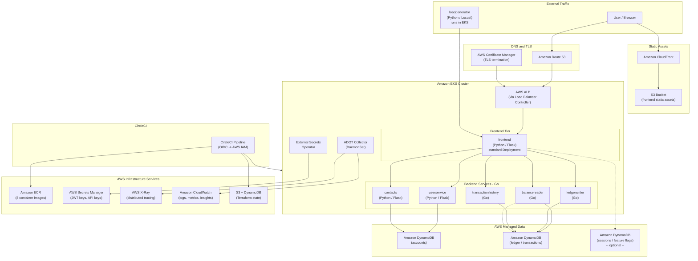
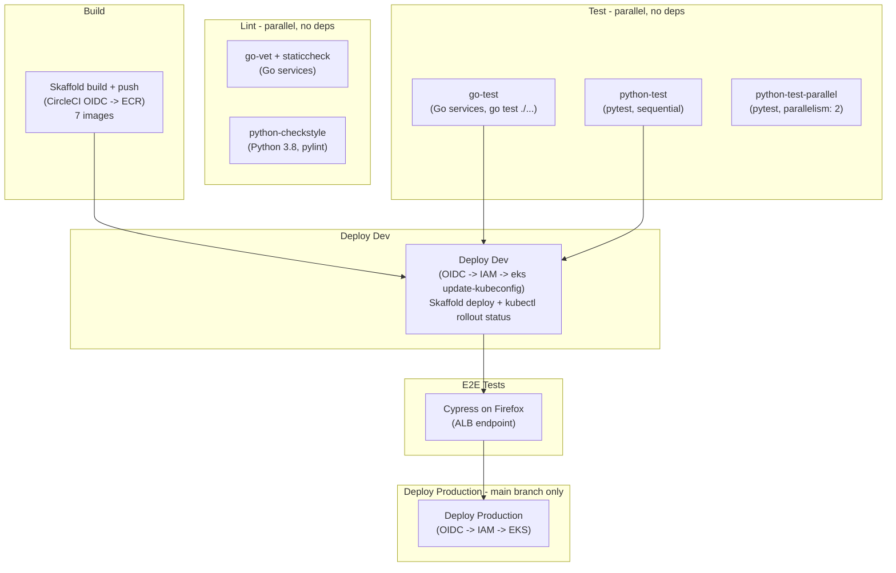

# CCI Bank Corp -- Proposed AWS-Native Architecture

## Architecture Overview

## Proposed Architecture Diagram (Mermaid)

---

## Why Go Over Java/OpenJDK

The current backend services (balancereader, ledgerwriter, transactionhistory) run on Java 17 / Spring Boot with OpenJDK and are built with Jib. Rewriting them in Go provides significant advantages for a containerized microservices showcase:

| Aspect | Java 17 / Spring Boot | Go |
|--------|----------------------|-----|
| **Container image size** | ~200-300 MB (JRE + fat JAR) | ~10-20 MB (static binary, scratch/distroless) |
| **Cold start time** | 3-8 seconds (JVM warmup) | 10-50 milliseconds |
| **Memory at idle** | 256-512 MB (JVM heap) | 10-30 MB |
| **Build tooling** | Maven + Jib (no Dockerfile) | Multi-stage Dockerfile (simple, no plugins) |
| **Concurrency** | Thread pools | Goroutines (lightweight, millions possible) |
| **Dependencies** | Large transitive dependency trees | Minimal, statically linked |
| **k8s resource requests** | cpu: 200m, memory: 512Mi typical | cpu: 50m, memory: 64Mi typical |

This means lower EKS node costs, faster scaling, faster CI builds, and a cleaner monorepo structure. The Python services (frontend, userservice, contacts) stay as-is, showcasing a polyglot monorepo with Python + Go.

### Build Method Changes

| Service | Current | Proposed |
|---------|---------|----------|
| `balancereader` | Java 17 / Jib (no Dockerfile) | Go / multi-stage Dockerfile |
| `ledgerwriter` | Java 17 / Jib (no Dockerfile) | Go / multi-stage Dockerfile |
| `transactionhistory` | Java 17 / Jib (no Dockerfile) | Go / multi-stage Dockerfile |
| `frontend` | Python 3.10 / Dockerfile | No change |
| `userservice` | Python 3.10 / Dockerfile | No change |
| `contacts` | Python 3.10 / Dockerfile | No change |
| `loadgenerator` | Python 3.10 / Dockerfile | No change |
| `accounts-db` | PostgreSQL 14 / Dockerfile | Removed (replaced by DynamoDB) |
| `ledger-db` | PostgreSQL 14 / Dockerfile | Removed (replaced by DynamoDB) |

Total images: 9 currently, 7 after migration (database containers eliminated).

---

## Why DynamoDB Over RDS PostgreSQL

The current databases run as PostgreSQL StatefulSets with `emptyDir` storage (data lost on every pod restart). Rather than replacing them with always-on RDS instances, DynamoDB provides a serverless, zero-maintenance alternative at a fraction of the cost.

### Cost Comparison (demo/showcase workload)

| Option | Monthly Cost | Maintenance | Scales to Zero |
|--------|-------------|-------------|----------------|
| **RDS PostgreSQL** (db.t4g.micro) | ~$30-60/mo (always-on) | Patching, backups, sizing | No |
| **Aurora Serverless v2** | ~$43/mo minimum (0.5 ACU floor) | Less, but still provisioned | No (scales down, not off) |
| **DocumentDB** | ~$57/mo minimum | Similar to RDS | No |
| **DynamoDB (pay-per-request)** | ~$0-5/mo for demo traffic | None | Yes |

DynamoDB is the only option that truly scales to zero cost when idle, which is ideal for a showcase application.

### Data Model Redesign

The banking app has two logical databases that map naturally to DynamoDB tables:

**Accounts domain** (currently `accounts-db`):

| Table | Partition Key | Sort Key | Access Patterns |
|-------|--------------|----------|-----------------|
| `Users` | `userId` | -- | Get/create user, authenticate |
| `Contacts` | `userId` | `contactId` | List contacts for user, add/remove |

**Ledger domain** (currently `ledger-db`):

| Table | Partition Key | Sort Key | Access Patterns |
|-------|--------------|----------|-----------------|
| `Transactions` | `accountId` | `timestamp#txnId` | List transactions by account (sorted by time) |
| `Balances` | `accountId` | -- | Get current balance (updated via DynamoDB transactions) |

DynamoDB transactions ensure that balance updates and transaction records are written atomically, preserving the consistency guarantees the banking app requires.

### What This Eliminates

- Two PostgreSQL StatefulSets (accounts-db, ledger-db)
- Two database container images (accounts-db, ledger-db Dockerfiles)
- Database credentials in ConfigMaps/Secrets (DynamoDB uses IAM roles)
- Connection string management (services use AWS SDK with IAM auth)
- ElastiCache Redis for balance caching (DynamoDB DAX or single-digit-ms reads replace this)

---

## Proposed CI/CD Pipeline

### Infrastructure Dependencies Per Stage

- **Build** -- CircleCI OIDC assumes an IAM role with ECR push permissions; Skaffold builds 7 images (3 Go, 3 Python, 1 loadgenerator) and pushes to ECR with git SHA tags
- **Deploy Dev** -- CircleCI OIDC assumes an IAM role with EKS + DynamoDB access; `aws eks update-kubeconfig` configures kubectl; Skaffold deploy applies manifests; `kubectl rollout status` confirms health
- **E2E** -- Cypress runs against the ALB endpoint (Route 53 DNS name)
- **Deploy Prod** -- Same as Dev but uses a separate IAM role / context and only runs on `main` branch

---

## Current vs. Proposed Comparison

| Concern | Current (CERA) | Proposed (AWS) |
|---------|---------------|----------------|
| **Container registry** | Nexus on CERA | Amazon ECR |
| **Cluster** | CERA k8s | Amazon EKS |
| **Ingress** | Istio Gateway + VirtualService | AWS ALB (Load Balancer Controller) |
| **TLS** | Manual / Istio | AWS Certificate Manager (free, auto-renewing) |
| **DNS** | `*.circleci-fieldeng.com` | Amazon Route 53 |
| **Frontend deploy strategy** | Argo Rollout (canary) | Standard Deployment (rolling update) |
| **Backend language** | Java 17 / Spring Boot (OpenJDK) | Go (static binaries, ~15 MB images) |
| **Backend build** | Jib (Maven plugin, no Dockerfile) | Multi-stage Dockerfile (simple, reproducible) |
| **accounts-db** | PostgreSQL StatefulSet (emptyDir -- ephemeral!) | Amazon DynamoDB (serverless, pay-per-request) |
| **ledger-db** | PostgreSQL StatefulSet (emptyDir -- ephemeral!) | Amazon DynamoDB (serverless, pay-per-request) |
| **Balance cache** | In-memory (lost on restart) | DynamoDB DAX or native single-digit-ms reads |
| **Sessions / config** | None | Amazon DynamoDB (optional, same table) |
| **Static assets** | Served by frontend pod | S3 + CloudFront |
| **Secrets** | Vault on CERA + plaintext ConfigMaps | AWS Secrets Manager + External Secrets Operator |
| **Tracing** | Jaeger on CERA | AWS X-Ray via ADOT Collector |
| **Monitoring** | None explicit | CloudWatch Container Insights |
| **CI/CD auth** | Vault OIDC | CircleCI OIDC -> AWS IAM |
| **IaC state** | None | S3 + DynamoDB (Terraform) |
| **DB credentials** | Plaintext in ConfigMaps | IAM role-based auth (no credentials) |
| **Container image count** | 9 | 7 (database containers eliminated) |
| **Multi-region strategy** | Matrix per CERA region (emea, namer) | Single cluster (configurable via pipeline params) |

---

## Effort Tiers

### Tier 1: Infrastructure (no app code changes)

- **EKS, ECR, ALB, ACM, Route 53** -- core platform
- **DynamoDB tables** -- provision via Terraform (Users, Contacts, Transactions, Balances)
- **AWS Secrets Manager + External Secrets Operator** -- JWT keys and any API keys
- **CloudWatch Container Insights** -- install EKS addon
- **S3 + DynamoDB for Terraform state** -- backend configuration
- **IAM roles** -- EKS pod roles with DynamoDB access, CircleCI OIDC role

### Tier 2: Backend service rewrite (Java -> Go)

- **balancereader** -- rewrite in Go with AWS SDK for DynamoDB reads
- **ledgerwriter** -- rewrite in Go with DynamoDB transactional writes
- **transactionhistory** -- rewrite in Go with DynamoDB query by account
- **Multi-stage Dockerfiles** -- replace Jib, target `scratch` or `gcr.io/distroless/static`
- **CI pipeline** -- replace `java-checkstyle` / `java-test-and-code-cov` with `go-vet` / `go-test`

### Tier 3: Python service updates

- **userservice** -- update data access from PostgreSQL to DynamoDB (boto3)
- **contacts** -- update data access from PostgreSQL to DynamoDB (boto3)
- **frontend** -- update connection config, remove DB connection string env vars
- **Remove accounts-db and ledger-db** -- delete StatefulSets, Dockerfiles, init scripts

### Tier 4: Observability and CDN (optional)

- **AWS X-Ray via ADOT Collector** -- swap OTEL exporter to ADOT DaemonSet
- **CloudFront + S3 for static assets** -- extract CSS/JS/images from frontend container

---

## AWS Services Summary

| AWS Service | Purpose | Required? |
|-------------|---------|-----------|
| Amazon EKS | Run microservices | Yes |
| Amazon ECR | Container image registry (7 images) | Yes |
| AWS ALB + LB Controller | Ingress and traffic routing | Yes |
| Amazon DynamoDB | All data storage (accounts, ledger, transactions, balances) | Yes |
| AWS Secrets Manager | Store JWT keys, API keys | Yes |
| External Secrets Operator | Sync Secrets Manager into k8s Secrets | Yes |
| AWS Certificate Manager | TLS certificates for ALB | Yes |
| Amazon Route 53 | DNS management | Yes |
| CircleCI OIDC + AWS IAM | CI/CD authentication + DynamoDB pod access | Yes |
| Amazon CloudWatch | Logs, metrics, container insights | Yes |
| S3 (Terraform state) | IaC state backend | Yes |
| AWS X-Ray + ADOT | Distributed tracing | Recommended |
| Amazon CloudFront + S3 | Static asset CDN | Optional |
| Amazon DynamoDB DAX | Microsecond-latency cache for balance reads | Optional |
