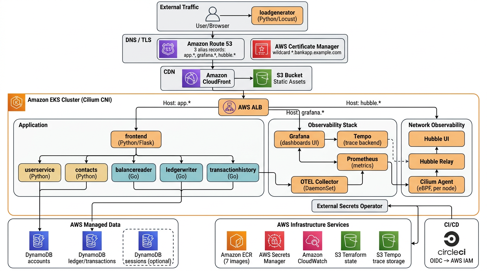
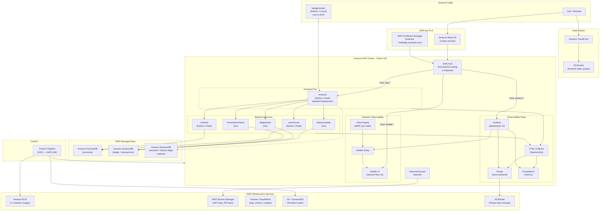
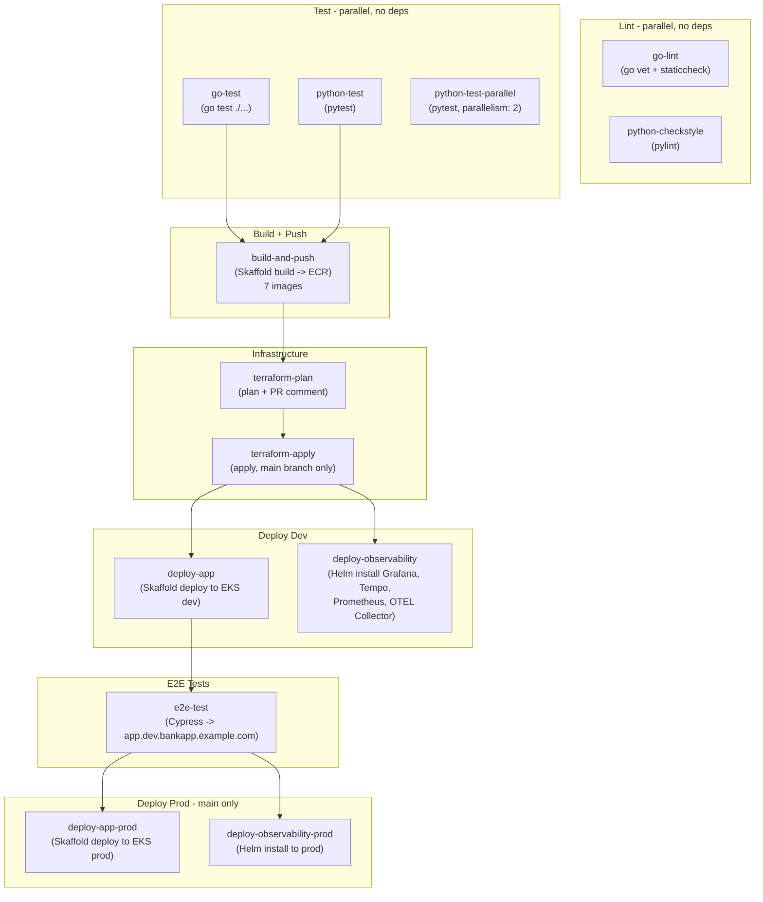

# CCI Bank Corp -- Proposed AWS-Native Architecture

## Architecture Overview



## Proposed Architecture Diagram (Mermaid)



---

## Observability Stack

Three demo endpoints share a single ALB with host-based routing and a single ACM wildcard certificate (`*.bankapp.example.com`):

| Subdomain | Routes To | What It Shows |
|-----------|-----------|---------------|
| `app.bankapp.example.com` | frontend Service | The banking application |
| `grafana.bankapp.example.com` | Grafana Service | Trace waterfalls, service dependency graphs, metrics dashboards, pod resource usage |
| `hubble.bankapp.example.com` | Hubble UI Service | Real-time network traffic flows between pods (eBPF-based, no sidecars) |

### Components

| Component | Runs As | Purpose | Storage |
|-----------|---------|---------|---------|
| **Grafana** | Deployment (1 pod) | Unified dashboard UI for traces, metrics, network flows | -- |
| **Tempo** | StatefulSet (1 pod) | Distributed tracing backend, receives spans from OTEL Collector | S3 bucket (durable, cheap) |
| **Prometheus** | StatefulSet (1 pod) | Metrics collection via scraping, feeds Grafana dashboards | PVC (ephemeral OK for demo) |
| **OTEL Collector** | DaemonSet (1 per node) | Receives traces/metrics from all services, forwards to Tempo + Prometheus | -- |
| **Cilium Agent** | DaemonSet (1 per node) | eBPF-based CNI, captures all network traffic at kernel level | -- |
| **Hubble Relay** | Deployment (1 pod) | Aggregates Cilium flow data from all nodes | -- |
| **Hubble UI** | Deployment (1 pod) | Web UI for real-time network flow visualization | -- |

Grafana also has a Hubble/Cilium datasource plugin, so network flow data can be pulled into Grafana dashboards alongside traces and metrics.

### Single Ingress Resource

All three endpoints are defined in one Kubernetes `Ingress` resource:

```yaml
apiVersion: networking.k8s.io/v1
kind: Ingress
metadata:
  name: main-ingress
  annotations:
    alb.ingress.kubernetes.io/scheme: internet-facing
    alb.ingress.kubernetes.io/target-type: ip
    alb.ingress.kubernetes.io/listen-ports: '[{"HTTPS": 443}]'
    alb.ingress.kubernetes.io/certificate-arn: <acm-wildcard-cert-arn>
    alb.ingress.kubernetes.io/ssl-redirect: "443"
spec:
  ingressClassName: alb
  rules:
  - host: app.bankapp.example.com
    http:
      paths:
      - path: /
        pathType: Prefix
        backend:
          service:
            name: frontend
            port:
              number: 80
  - host: grafana.bankapp.example.com
    http:
      paths:
      - path: /
        pathType: Prefix
        backend:
          service:
            name: grafana
            port:
              number: 3000
  - host: hubble.bankapp.example.com
    http:
      paths:
      - path: /
        pathType: Prefix
        backend:
          service:
            name: hubble-ui
            port:
              number: 80
```

---

## Why Go Over Java/OpenJDK

The current backend services (balancereader, ledgerwriter, transactionhistory) run on Java 17 / Spring Boot with OpenJDK and are built with Jib. Rewriting them in Go provides significant advantages for a containerized microservices showcase:

| Aspect | Java 17 / Spring Boot | Go |
|--------|----------------------|-----|
| **Container image size** | ~200-300 MB (JRE + fat JAR) | ~10-20 MB (static binary, scratch/distroless) |
| **Cold start time** | 3-8 seconds (JVM warmup) | 10-50 milliseconds |
| **Memory at idle** | 256-512 MB (JVM heap) | 10-30 MB |
| **Build tooling** | Maven + Jib (no Dockerfile) | Multi-stage Dockerfile (simple, no plugins) |
| **Concurrency** | Thread pools | Goroutines (lightweight, millions possible) |
| **Dependencies** | Large transitive dependency trees | Minimal, statically linked |
| **k8s resource requests** | cpu: 200m, memory: 512Mi typical | cpu: 50m, memory: 64Mi typical |

This means lower EKS node costs, faster scaling, faster CI builds, and a cleaner monorepo structure. The Python services (frontend, userservice, contacts) stay as-is, showcasing a polyglot monorepo with Python + Go.

### Build Method Changes

| Service | Current | Proposed |
|---------|---------|----------|
| `balancereader` | Java 17 / Jib (no Dockerfile) | Go / multi-stage Dockerfile |
| `ledgerwriter` | Java 17 / Jib (no Dockerfile) | Go / multi-stage Dockerfile |
| `transactionhistory` | Java 17 / Jib (no Dockerfile) | Go / multi-stage Dockerfile |
| `frontend` | Python 3.10 / Dockerfile | No change |
| `userservice` | Python 3.10 / Dockerfile | No change |
| `contacts` | Python 3.10 / Dockerfile | No change |
| `loadgenerator` | Python 3.10 / Dockerfile | No change |
| `accounts-db` | PostgreSQL 14 / Dockerfile | Removed (replaced by DynamoDB) |
| `ledger-db` | PostgreSQL 14 / Dockerfile | Removed (replaced by DynamoDB) |

Total images: 9 currently, 7 after migration (database containers eliminated).

---

## Why DynamoDB Over RDS PostgreSQL

The current databases run as PostgreSQL StatefulSets with `emptyDir` storage (data lost on every pod restart). Rather than replacing them with always-on RDS instances, DynamoDB provides a serverless, zero-maintenance alternative at a fraction of the cost.

### Cost Comparison (demo/showcase workload)

| Option | Monthly Cost | Maintenance | Scales to Zero |
|--------|-------------|-------------|----------------|
| **RDS PostgreSQL** (db.t4g.micro) | ~$30-60/mo (always-on) | Patching, backups, sizing | No |
| **Aurora Serverless v2** | ~$43/mo minimum (0.5 ACU floor) | Less, but still provisioned | No (scales down, not off) |
| **DocumentDB** | ~$57/mo minimum | Similar to RDS | No |
| **DynamoDB (pay-per-request)** | ~$0-5/mo for demo traffic | None | Yes |

DynamoDB is the only option that truly scales to zero cost when idle, which is ideal for a showcase application.

### Data Model Redesign

The banking app has two logical databases that map naturally to DynamoDB tables:

**Accounts domain** (currently `accounts-db`):

| Table | Partition Key | Sort Key | Access Patterns |
|-------|--------------|----------|-----------------|
| `Users` | `userId` | -- | Get/create user, authenticate |
| `Contacts` | `userId` | `contactId` | List contacts for user, add/remove |

**Ledger domain** (currently `ledger-db`):

| Table | Partition Key | Sort Key | Access Patterns |
|-------|--------------|----------|-----------------|
| `Transactions` | `accountId` | `timestamp#txnId` | List transactions by account (sorted by time) |
| `Balances` | `accountId` | -- | Get current balance (updated via DynamoDB transactions) |

DynamoDB transactions ensure that balance updates and transaction records are written atomically, preserving the consistency guarantees the banking app requires.

### What This Eliminates

- Two PostgreSQL StatefulSets (accounts-db, ledger-db)
- Two database container images (accounts-db, ledger-db Dockerfiles)
- Database credentials in ConfigMaps/Secrets (DynamoDB uses IAM roles)
- Connection string management (services use AWS SDK with IAM auth)
- ElastiCache Redis for balance caching (DynamoDB DAX or single-digit-ms reads replace this)

---

## Repository File Structure

```
circle-banking-app/
├── .circleci/
│   ├── config.yml                          # Main pipeline
│   ├── merge-pr.yml                        # Merge PR workflow
│   └── open-pr.yml                         # Open PR workflow
│
├── terraform/                              # All AWS infrastructure
│   ├── main.tf                             # Provider config, locals
│   ├── variables.tf                        # Input variables
│   ├── outputs.tf                          # EKS endpoint, ECR URIs, ALB DNS, etc.
│   ├── backend.tf                          # S3 + DynamoDB state backend
│   ├── eks.tf                              # EKS cluster + managed node groups
│   ├── ecr.tf                              # 7 ECR repositories
│   ├── dynamodb.tf                         # Tables: Users, Contacts, Transactions, Balances
│   ├── iam.tf                              # Pod roles (DynamoDB, S3), CircleCI OIDC role
│   ├── route53.tf                          # Hosted zone + 3 alias records
│   ├── acm.tf                              # Wildcard certificate
│   ├── s3.tf                               # Trace storage bucket, static assets bucket
│   ├── secrets-manager.tf                  # JWT keys, API keys
│   ├── cilium.tf                           # Cilium CNI + Hubble (Helm provider)
│   ├── alb-controller.tf                   # AWS LB Controller (Helm provider)
│   ├── cloudwatch.tf                       # Container Insights EKS addon
│   └── terraform.tfvars.example            # Example variable values
│
├── kubernetes-manifests/                   # All k8s deployments
│   ├── app/                                # Application workloads
│   │   ├── frontend/
│   │   │   ├── deployment.yaml
│   │   │   └── service.yaml
│   │   ├── userservice/
│   │   │   ├── deployment.yaml
│   │   │   └── service.yaml
│   │   ├── contacts/
│   │   │   ├── deployment.yaml
│   │   │   └── service.yaml
│   │   ├── balancereader/
│   │   │   ├── deployment.yaml
│   │   │   └── service.yaml
│   │   ├── ledgerwriter/
│   │   │   ├── deployment.yaml
│   │   │   └── service.yaml
│   │   ├── transactionhistory/
│   │   │   ├── deployment.yaml
│   │   │   └── service.yaml
│   │   ├── loadgenerator/
│   │   │   └── deployment.yaml
│   │   ├── config.yaml                     # ConfigMaps, ExternalSecret CRs
│   │   └── ingress.yaml                    # Single ALB Ingress (3 host rules)
│   ├── observability/                      # Helm values for observability stack
│   │   ├── grafana-values.yaml
│   │   ├── tempo-values.yaml
│   │   ├── prometheus-values.yaml
│   │   └── otel-collector.yaml             # OTEL Collector DaemonSet manifest
│   └── overlays/                           # Kustomize per-environment overrides
│       ├── dev/
│       │   └── kustomization.yaml
│       └── prod/
│           └── kustomization.yaml
│
├── src/                                    # Application source code
│   ├── frontend/                           # Python/Flask (unchanged)
│   ├── userservice/                        # Python/Flask (updated: psycopg2 -> boto3)
│   ├── contacts/                           # Python/Flask (updated: psycopg2 -> boto3)
│   ├── balancereader/                      # Go (rewritten from Java)
│   ├── ledgerwriter/                       # Go (rewritten from Java)
│   ├── transactionhistory/                 # Go (rewritten from Java)
│   └── loadgenerator/                      # Python/Locust (unchanged)
│
├── ui-tests/                               # Cypress E2E (update baseUrl)
│   ├── cypress.config.js
│   └── cypress/
│
├── docs/
│   ├── architecture.md                     # Current (CERA) architecture
│   ├── proposed-architecture.md            # This file
│   └── proposed-architecture.png
│
├── skaffold.yaml                           # Updated: 7 images, ECR targets
├── CLAUDE.md                               # Implementation guide for AI agent
└── README.md
```

### Files Removed

| Path | Reason |
|------|--------|
| `src/accounts-db/` | Replaced by DynamoDB |
| `src/ledger-db/` | Replaced by DynamoDB |
| `src/ledgermonolith/` | Legacy monolith, not deployed |
| `dev-kubernetes-manifests/` | Replaced by `kubernetes-manifests/` |
| `istio-manifests/` | Istio removed, ALB replaces it |
| `pom.xml`, `mvnw`, `mvnw.cmd`, `.mvn/` | No more Java/Maven |
| `.circleci/vault/` | Vault removed, using Secrets Manager |
| `.circleci/release_tracking/virtual_service_*.yaml` | No more Istio VirtualServices |
| `extras/jwt/` | JWT keys move to Secrets Manager |

---

## Terraform Resources

All AWS infrastructure is managed by Terraform in the `terraform/` directory:

| File | What It Provisions |
|------|-------------------|
| `main.tf` | AWS provider, Helm provider, Kubernetes provider, locals |
| `variables.tf` | Input variables (cluster name, region, domain, environment) |
| `outputs.tf` | EKS endpoint, ECR URIs, ALB DNS name, DynamoDB table names |
| `backend.tf` | S3 bucket + DynamoDB table for Terraform state locking |
| `eks.tf` | EKS cluster, managed node groups, OIDC identity provider |
| `ecr.tf` | 7 ECR repositories (one per service image) |
| `dynamodb.tf` | 4 DynamoDB tables (Users, Contacts, Transactions, Balances) in pay-per-request mode |
| `iam.tf` | IAM roles: EKS pod roles (DynamoDB access, S3 access), CircleCI OIDC provider + assume role |
| `route53.tf` | Hosted zone + 3 alias records (app, grafana, hubble -> ALB) |
| `acm.tf` | Wildcard ACM certificate (`*.bankapp.example.com`) with DNS validation |
| `s3.tf` | Tempo trace storage bucket, frontend static assets bucket |
| `secrets-manager.tf` | Secrets Manager entries for JWT keys, any API keys |
| `cilium.tf` | Cilium CNI + Hubble (via Helm provider, installed before pods can schedule) |
| `alb-controller.tf` | AWS Load Balancer Controller (via Helm provider) |
| `cloudwatch.tf` | Container Insights EKS addon |
| `terraform.tfvars.example` | Example variable values for onboarding |

---

## Proposed CI/CD Pipeline



### Infrastructure Dependencies Per Stage

- **Lint** -- No external deps. Go services use `go vet` + `staticcheck`. Python services use `pylint`.
- **Test** -- No external deps. Go services use `go test ./...`. Python services use `pytest`.
- **Build + Push** -- CircleCI OIDC assumes an IAM role with ECR push permissions; Skaffold builds 7 images (3 Go, 3 Python, 1 loadgenerator) and pushes to ECR with git SHA tags.
- **Terraform Plan** -- Runs `terraform plan` and posts the diff as a PR comment. Runs on every PR.
- **Terraform Apply** -- Runs `terraform apply -auto-approve` on `main` branch only after merge.
- **Deploy App** -- CircleCI OIDC assumes an IAM role with EKS access; `aws eks update-kubeconfig` configures kubectl; Skaffold deploy applies manifests from `kubernetes-manifests/app/`; `kubectl rollout status` confirms health.
- **Deploy Observability** -- `helm upgrade --install` for Grafana, Tempo, Prometheus using values from `kubernetes-manifests/observability/`. Applies OTEL Collector DaemonSet manifest.
- **E2E** -- Cypress runs against `app.dev.bankapp.example.com` (ALB endpoint via Route 53).
- **Deploy Prod** -- Same as Dev but uses a separate IAM role / context and only runs on `main` branch.

---

## Current vs. Proposed Comparison

| Concern | Current (CERA) | Proposed (AWS) |
|---------|---------------|----------------|
| **Container registry** | Nexus on CERA | Amazon ECR |
| **Cluster** | CERA k8s | Amazon EKS |
| **CNI** | Default | Cilium (eBPF-based, network policies, flow visibility) |
| **Ingress** | Istio Gateway + VirtualService | AWS ALB (Load Balancer Controller, host-based routing) |
| **TLS** | Manual / Istio | AWS Certificate Manager (wildcard, auto-renewing) |
| **DNS** | `*.circleci-fieldeng.com` | Amazon Route 53 (3 subdomains) |
| **Frontend deploy strategy** | Argo Rollout (canary) | Standard Deployment (rolling update) |
| **Backend language** | Java 17 / Spring Boot (OpenJDK) | Go (static binaries, ~15 MB images) |
| **Backend build** | Jib (Maven plugin, no Dockerfile) | Multi-stage Dockerfile (simple, reproducible) |
| **accounts-db** | PostgreSQL StatefulSet (emptyDir -- ephemeral!) | Amazon DynamoDB (serverless, pay-per-request) |
| **ledger-db** | PostgreSQL StatefulSet (emptyDir -- ephemeral!) | Amazon DynamoDB (serverless, pay-per-request) |
| **Balance cache** | In-memory (lost on restart) | DynamoDB native single-digit-ms reads (or DAX) |
| **Sessions / config** | None | Amazon DynamoDB (optional, same table) |
| **Static assets** | Served by frontend pod | S3 + CloudFront |
| **Secrets** | Vault on CERA + plaintext ConfigMaps | AWS Secrets Manager + External Secrets Operator |
| **Tracing** | Jaeger on CERA | Grafana + Tempo (traces stored in S3) |
| **Metrics** | None explicit | Prometheus + Grafana dashboards |
| **Network observability** | None | Cilium Hubble UI (real-time pod traffic flows) |
| **Monitoring** | None explicit | CloudWatch Container Insights |
| **Observability endpoints** | None | `grafana.*` and `hubble.*` behind same ALB |
| **CI/CD auth** | Vault OIDC | CircleCI OIDC -> AWS IAM |
| **IaC** | None | Terraform (all infra in `terraform/`) |
| **IaC state** | None | S3 + DynamoDB (Terraform) |
| **DB credentials** | Plaintext in ConfigMaps | IAM role-based auth (no credentials) |
| **Container image count** | 9 | 7 (database containers eliminated) |
| **Multi-region strategy** | Matrix per CERA region (emea, namer) | Single cluster (configurable via pipeline params) |

---

## Effort Tiers

### Tier 1: Terraform Infrastructure

- **EKS cluster** -- managed node groups, OIDC provider
- **ECR** -- 7 repositories
- **DynamoDB** -- 4 tables (Users, Contacts, Transactions, Balances) in pay-per-request mode
- **IAM roles** -- EKS pod roles (DynamoDB, S3 access), CircleCI OIDC provider + role
- **Route 53** -- hosted zone + 3 alias records (app, grafana, hubble)
- **ACM** -- wildcard certificate with DNS validation
- **S3** -- Tempo trace storage, frontend static assets, Terraform state
- **Secrets Manager** -- JWT keys, API keys
- **Cilium + Hubble** -- CNI installed via Helm provider
- **ALB Controller** -- installed via Helm provider
- **CloudWatch** -- Container Insights addon

### Tier 2: Kubernetes Manifests

- **Application manifests** -- Deployments + Services for all 7 services in `kubernetes-manifests/app/`
- **Ingress** -- single ALB Ingress with 3 host rules
- **Config** -- ConfigMaps, ExternalSecret CRs
- **Kustomize overlays** -- dev/prod overrides for image tags, replicas, resource limits

### Tier 3: Backend Service Rewrite (Java -> Go)

- **balancereader** -- rewrite in Go with AWS SDK for DynamoDB reads
- **ledgerwriter** -- rewrite in Go with DynamoDB transactional writes
- **transactionhistory** -- rewrite in Go with DynamoDB query by account
- **Multi-stage Dockerfiles** -- `golang:1.22` build stage -> `gcr.io/distroless/static` runtime
- **CI pipeline** -- replace `java-checkstyle` / `java-test-and-code-cov` with `go-lint` / `go-test`

### Tier 4: Python Service Updates

- **userservice** -- update data access from PostgreSQL to DynamoDB (boto3)
- **contacts** -- update data access from PostgreSQL to DynamoDB (boto3)
- **frontend** -- update connection config, remove DB connection string env vars

### Tier 5: Observability Stack

- **Grafana** -- Helm install with Tempo + Prometheus datasources preconfigured
- **Tempo** -- Helm install with S3 backend for trace storage
- **Prometheus** -- Helm install with service discovery for all pods
- **OTEL Collector** -- DaemonSet manifest, receives traces from Go (otlp) and Python (otlp) services
- **Hubble UI** -- enabled via Cilium Helm values (already installed in Tier 1)

### Tier 6: Cleanup

- Remove `src/accounts-db/`, `src/ledger-db/`, `src/ledgermonolith/`
- Remove `dev-kubernetes-manifests/`, `istio-manifests/`
- Remove `pom.xml`, `mvnw`, `mvnw.cmd`, `.mvn/`
- Remove `.circleci/vault/`, `.circleci/release_tracking/virtual_service_*.yaml`
- Remove `extras/jwt/`
- Update `skaffold.yaml` for 7 images targeting ECR
- Update `README.md`

---

## AWS Services Summary

| AWS Service | Purpose | Required? |
|-------------|---------|-----------|
| Amazon EKS | Run microservices + observability stack | Yes |
| Amazon ECR | Container image registry (7 images) | Yes |
| AWS ALB + LB Controller | Ingress with host-based routing (3 endpoints) | Yes |
| Amazon DynamoDB | All data storage (accounts, ledger, transactions, balances) | Yes |
| AWS Secrets Manager | Store JWT keys, API keys | Yes |
| External Secrets Operator | Sync Secrets Manager into k8s Secrets | Yes |
| AWS Certificate Manager | Wildcard TLS certificate for ALB | Yes |
| Amazon Route 53 | DNS management (3 subdomains) | Yes |
| CircleCI OIDC + AWS IAM | CI/CD authentication + pod DynamoDB/S3 access | Yes |
| Amazon CloudWatch | Logs, metrics, container insights | Yes |
| S3 (Terraform state) | IaC state backend with DynamoDB locking | Yes |
| S3 (Tempo traces) | Durable, cheap storage for distributed traces | Yes |
| Cilium + Hubble | eBPF CNI, network policies, network flow visualization | Yes |
| Grafana + Tempo + Prometheus | Tracing, metrics, dashboards (exposed at `grafana.*`) | Yes |
| Amazon CloudFront + S3 | Static asset CDN for frontend | Optional |
| Amazon DynamoDB DAX | Microsecond-latency cache for balance reads | Optional |
